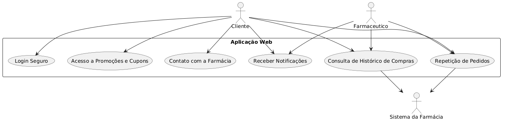
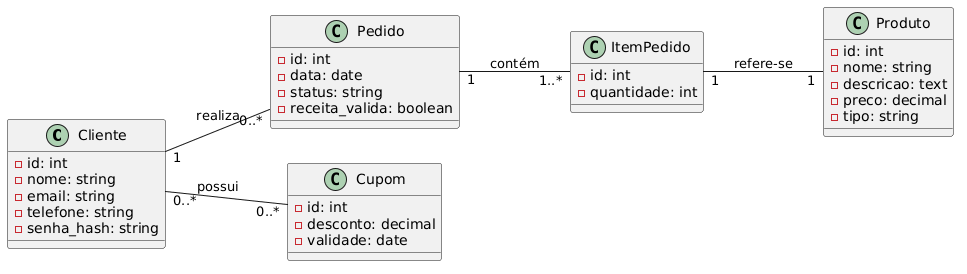
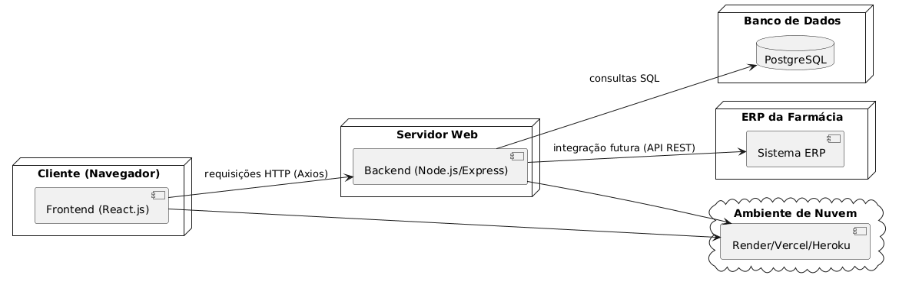

# pce-modelos-uml
Modelagem de engenharia de software e diagramas de arquitetura do sistema.
# PCE - Modelagem e Engenharia de Software

Este repositório centraliza os artefatos de engenharia de software, diagramas arquiteturais e documentação visual da aplicação web para clientes de farmácia de manipulação.

## 📊 Artefatos e Diagramas Disponíveis

Para apoiar a compreensão do sistema e guiar o desenvolvimento técnico, o projeto conta com as seguintes modelagens:

### 1. Diagrama de Caso de Uso
Representa as interações entre os atores principais (cliente, farmacêutico e sistema da farmácia) e as funcionalidades essenciais, como login seguro, consulta de histórico e repetição de pedidos, evidenciando o fluxo de autoatendimento.

### 2. Diagrama de Classes (Classes de Negócio)
Mapeia as entidades centrais do sistema (Cliente, Pedido, Produto, Item Pedido e Cupom), detalhando os atributos e relacionamentos que refletem as regras de negócio da farmácia.

* **Visualização Horizontal:**

### 3. Diagrama de Componentes e Implantação
Ilustra a infraestrutura do sistema e a divisão em camadas (MVC). Evidencia a comunicação do frontend em React.js (via Axios) com o backend em Node.js/Express, o acesso ao banco PostgreSQL e a previsão de integração com o ERP. Também mapeia a distribuição física do ambiente local para a nuvem.

---
*Os arquivos de imagem originais estão disponíveis na raiz deste repositório para consulta da banca examinadora e da Product Owner Simone Parisi.*
